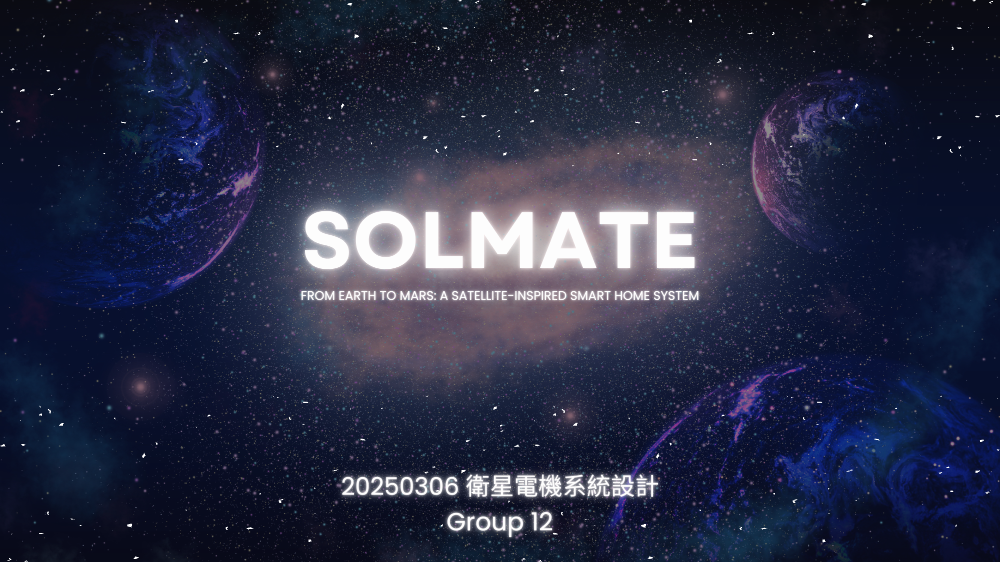

# SOLMATE: Satellite-Inspired Smart Home / Rover System

> A group embedded-systems project combining web control, short-range RF communication, environmental sensing, solar tracking, and a mobile rover platform.

<p align="center">
  
</p>

## Overview

**SOLMATE** was developed as a satellite- and Mars-rover-inspired system for the NTHU course **衛星電機系統設計**. The project connects a browser-based controller to an ESP32, an nRF24L01 wireless link, and Arduino-based hardware so a user can remotely control a small vehicle while monitoring sensor data.

The presentation documents the project from the initial concept through checkpoint testing and the final system report. It includes hardware photos, architecture diagrams, controller logic, solar-tracker work, sensor monitoring, and embedded demonstration videos.

> This is a **group academic project**. The repository preserves the project materials and documents the system shown in the submitted presentation; it does not claim that every component was produced individually by one contributor.

## System architecture

```text
Web / React controller
        │ HTTP / Wi-Fi
        ▼
      ESP32
        │ SPI
        ▼
    nRF24L01
        )) 2.4 GHz RF ((
    nRF24L01
        │
        ▼
 Arduino-based hardware
   ├── vehicle motors
   ├── servo / solar tracker
   └── sensors
```

The final deck describes the end-to-end control path as:

**Web service → ESP32 → nRF24L01 → nRF24L01 → Arduino → car / smart-home hardware**.

## What is demonstrated

- **Web-controlled rover** with forward, reverse, left, right, and stop commands
- **React-based controller UI** sending HTTP requests to the ESP32
- Mouse/trackpad directional control and a simple Mars-surface path visualizer
- **nRF24L01 2.4 GHz communication** between the controller side and hardware side
- **ESP32** as the Wi-Fi-facing controller and bridge to the RF link
- **Arduino** handling vehicle-side actuation
- Environmental sensing using **DHT**, sound, and dust sensing
- Live sensor-value / graph concepts in the web dashboard
- **Light-sensor + servo solar tracking**
- Hardware testing and embedded video documentation inside the original PowerPoint

## Engineering notes

### Wireless communication

The project uses the nRF24L01 as a low-cost, low-power RF link. The final report discusses SPI communication, packet/ACK debugging, automatic retransmission, channel testing, TX power adjustment, dynamic payloads, and the tradeoff of using **1 Mbps** for improved receiver sensitivity.

### Web controller

The controller presentation shows a React/JSX workflow in which a movement command updates three things at once:

1. sends the command to the ESP32,
2. updates the displayed direction state,
3. updates the rover position on the map visualizer.

### Environmental monitoring

The project uses available sensors to create a **space-environment simulation**. In particular, the dust sensor is treated as an environmental/radiation analogue in the project presentation; it is **not a true ionizing-radiation detector**. One of the proposed future improvements is replacing it with an actual radiation detector.

### Solar tracking

The project evolved during development. An intermediate checkpoint documents a simple tracker using **two photoresistors**, while the broader system design describes a multi-light-sensor tracker with servo actuation. Electrical storage / power integration was also identified as an area needing further work during development.

## Project progression

The slides document three stages:

- **Initial proposal:** rover/smart-home concept, sensor monitoring, nRF24L01 communication, and solar tracking
- **Checkpoint:** working car control from the web service, wireless communication, basic tracker testing, and remaining power/UI work
- **Final report:** detailed RF design, sensor setup, ESP32 rationale, React controller behavior, solar control, hardware tests, and project documentation

## Preserved project files

| File | Purpose |
|---|---|
| [`docs/solmate-project-presentation.pptx`](docs/solmate-project-presentation.pptx) | Original editable PowerPoint with embedded media and demo videos |
| [`docs/solmate-project-presentation.pdf`](docs/solmate-project-presentation.pdf) | PDF export for easier browser viewing |
| [`ORIGINAL_FILE_MANIFEST.tsv`](ORIGINAL_FILE_MANIFEST.tsv) | SHA-256 integrity record for preserved source artifacts |

The PowerPoint is about **108 MB** because it contains embedded videos, so it is configured for **Git LFS**.

## Repository structure

```text
.
├── README.md
├── .gitattributes
├── SETUP.md
├── PUBLICATION_NOTES.md
├── ORIGINAL_FILE_MANIFEST.tsv
├── assets/
│   └── preview.png
└── docs/
    ├── solmate-project-presentation.pptx
    └── solmate-project-presentation.pdf
```

## Preservation

The PowerPoint and PDF in `docs/` are preserved copies of the submitted project artifacts. Their contents were not edited. The README and preview image are portfolio/documentation additions only.

## Publishing

Read [`SETUP.md`](SETUP.md) before pushing because the `.pptx` must be uploaded through Git LFS. Also review [`PUBLICATION_NOTES.md`](PUBLICATION_NOTES.md) because the presentation is group work and contains third-party imagery and embedded media.
